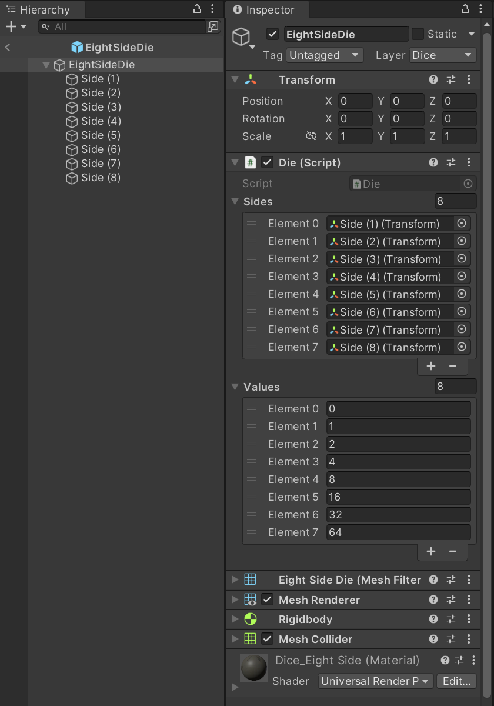

# Dice demo


The project presented here is one example of how a physically plausible 
dice-rolling simulation can be implemented using the Unity game engine. 
The assets for building the project were taken from the previously published 
[__Board game simulator__](https://store.steampowered.com/app/856670/Present_for_Manager/). 
In addition to the simulation of throwing dice, the ability to change and 
save the Theme of the game table has been added to the scene.
<br/><br/>

# Project Structure

When creating the scene, generally accepted architectural practices and 
third-party libraries, allowing the use of a large amount of abstraction, 
dependency injection and maintenance of a growing project, were not used. 
On the contrary, the structure is built in a simplified and even primitive 
form. At the same time, the game code is simple enough for developers of 
almost any skill level to understand and analyze.

The entry point to the program is the Start() method of the 
GameProcessor class. This class is a kind of Mediator, which coordinates 
all the processes of the program, passing them through itself. Only instead 
of injecting itself as a dependency, it injects its specific methods. Thus, 
each separate layer of the application can only call the method strictly 
assigned to it in the GameProcessor class.


All application layers referenced by the GameProcessor class are 
independent, do not know about other layers, and are pre-configured using 
the Awake() methods of the corresponding objects, if necessary.
<br/><br/>

# Universal RP

Perhaps Scriptable Render Pipeline would be more suitable for such a 
project. But all textures and materials were transferred from an existing 
project, and were configured for Universal Render Pipeline. It was 
decided not to change anything and apply Universal Render Pipeline in 
the proposed scene, despite all the flaws in the initial implementation of 
materials and lighting.
<br/><br/>

# Usage

* Clone the repo as usual via cmd/terminal or in your favourite Git GUI 
software.
* Open the project folder in Unity Hub using 2021.3.14f1 or a more recent 
of 2021.3 editor versions.     
* Open scene "Project/Assets/Scenes/DiceDemo.unity".
* Choose the Game view tab and set your preferred Aspect settings in the editor.
* Use the Play button in the Toolbar to see how the application plays.
<br/><br/>

# Dice

Since the main mechanics of this project is the dice roll simulation, let's dwell on this part in a little more detail. Much of the process of getting a random and balanced roll result is hidden in the code. At the same time, the system is designed in such a way that it is possible to make some important changes while in the inspector.

There is DiceSpawner gameobject in the Gameplay layer of the scene. The DiceFactory class is attached to it, in which the DiceSet field is serialized.


Here you can change the number of dice in the set and fill it with prefabs in the desired order. There must be at least one die in the set, otherwise the application will throw the corresponding exception at the launch.

In the world of board games, there are not only classic dice. Players use bizarre shaped dice with different numbers of faces and specific values. The project allows you to add new types of dice without changing a single line of code. After importing a custom die model and a collider to it into the project, it is enough to create the corresponding prefab and you can use it in the DiceSet. To make it a little easier to understand the process of creating a custom die prefab, an additional eight-sided die has been added to the project.


On the example of it prefab, you can see the differences in object settings compared to the original die prefab. Please note that the number of die sides added to the Die class in the inspector must match the number of corresponding values.



Some dice shapes may require you to create your own physical material, such as with different friction settings. Also, for the desired behavior of the object during the simulation, you can separately adjust the parameters of the ridgidbody, such as mass and drag. If these tools are not enough, you can influence the throw parameters quite strongly by changing the constant fields of the ImpulseGenerator class.

```csharp
using System;
using UnityEngine;
using Random = UnityEngine.Random;

namespace DiceDemo.Gameplay
{
    public class ImpulseGenerator
    {
        private const float _minTorque = 0.01f;
        private const float _maxTorque = 0.02f;

        private const float _minDeviation = 0.1f;
        private const float _maxDeviation = 0.2f;

        private const float _minThrust = 5.6f;
        private const float _maxThrust = 6.4f;

        public ImpulseGenerator()
        {
            Random.InitState((int)DateTime.UtcNow.Ticks);
        }

        public RandomImpulse GenerateRandomImpulse()
        {
            Quaternion rotation = Random.rotation;
            Vector3 torque = Random.onUnitSphere * Random.Range(_minTorque, _maxTorque);
            Vector3 deviation = Random.onUnitSphere * Random.Range(_minDeviation, _maxDeviation);
            float thrust = Random.Range(_minThrust, _maxThrust);

            return new RandomImpulse(rotation, torque, deviation, thrust);
        }
    }
}
```
<br/>

# License

    The MIT License (MIT)

    Copyright (c) 2023 Alexander Shkurlatov

    Permission is hereby granted, free of charge, to any person obtaining a copy
    of this software and associated documentation files (the "Software"), to deal
    in the Software without restriction, including without limitation the rights
    to use, copy, modify, merge, publish, distribute, sublicense, and/or sell
    copies of the Software, and to permit persons to whom the Software is
    furnished to do so, subject to the following conditions:

    The above copyright notice and this permission notice shall be included in all
    copies or substantial portions of the Software.

    THE SOFTWARE IS PROVIDED "AS IS", WITHOUT WARRANTY OF ANY KIND, EXPRESS OR
    IMPLIED, INCLUDING BUT NOT LIMITED TO THE WARRANTIES OF MERCHANTABILITY,
    FITNESS FOR A PARTICULAR PURPOSE AND NONINFRINGEMENT. IN NO EVENT SHALL THE
    AUTHORS OR COPYRIGHT HOLDERS BE LIABLE FOR ANY CLAIM, DAMAGES OR OTHER
    LIABILITY, WHETHER IN AN ACTION OF CONTRACT, TORT OR OTHERWISE, ARISING FROM,
    OUT OF OR IN CONNECTION WITH THE SOFTWARE OR THE USE OR OTHER DEALINGS IN THE
    SOFTWARE.
    